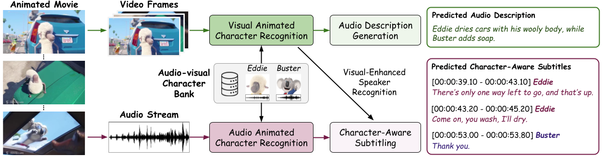

# Character-Centric Understanding of Animated Movies

Zhongrui Gui<sup>1</sup>, Junyu Xie<sup>1</sup>, Tengda Han<sup>1</sup>, Weidi Xie <sup>2</sup>, Andrew Zisserman<sup>1</sup>

<sup>1</sup> Visual Geometry Group (VGG), University of Oxford <br>
<sup>2</sup> School of Artificial Intelligence (SAI), Shanghai Jiao Tong University

<a src="https://img.shields.io/badge/cs.CV-2504.01020-b31b1b?logo=arxiv&logoColor=red" href="https://arxiv.org/pdf/2509.12204">  
</a>
<a href="https://www.robots.ox.ac.uk/~vgg/research/animated_ad/" alt="Project page"> 
</a>
<br>
<br>
<p align="center">
  
</p>


## Method and Evaluation
In this work, we propose to construct an audio-visual character bank automatically to enable audio-visual recognition of animated characters. We further leverage the results for downstream tasks, including Audio Description (AD) Generation and Character-Aware Subtitling. There are several main components in our work, and we list them below.

### Pipeline
* See [here](https://github.com/g2zr004/Animated_AD/tree/main/build_character_bank) for constructing the **Audio-Visual Character Bank**. 
* See [here](https://github.com/g2zr004/Animated_AD/tree/main/character_recognition) for **Audio-Visual Recognition for Animated Characters**.
* See [here](https://github.com/g2zr004/Animated_AD/tree/main/app) for **Application on Downstream Tasks**.

### Evaluation
* Videos can be downloaded [here](https://www.dropbox.com/scl/fo/ek8b9hzbtos3gxwsbrqdb/ACQURGZ_Gmrb35UWDhUFZas?rlkey=r1er2iswst6kymueb5z2wi9y5&st=xeh1xcqc&dl=0).
* All annotations and the corresponding meta-information can be found [here](https://drive.google.com/drive/folders/1Jb3N1fMAAA8cRxrAFUoAWqFWdwtTuUcE?usp=sharing).
* Evaluation scripts, including Character Box mIoU, Character Name AP, and Audio Recognition AP can be found [here](https://github.com/g2zr004/Animated_AD/tree/main/character_recognition/eval). For CRITIC and CIDEr, please refer to the original [AutoAD](https://github.com/TengdaHan/AutoAD/tree/main/autoad_iii/metrics) repository.

### Predicted Results
* The visual character recognition results can be downloaded [here](https://drive.google.com/drive/folders/1YwACigVKwHRNtyXcBV_7edXqQQWP9EBb?usp=sharing).
* The audio character recognition results can be downloaded [here](https://drive.google.com/drive/folders/1MAfKV5z60ZOmdlN3l37MFos1Qpw3RNJU?usp=sharing).
* The AD predictions (by Qwen2-VL w/ LLaMA3 or VideoLLaMA2 w/ LLaMA3) can be downloaded [here](https://drive.google.com/drive/folders/1Fo-x-5KcQroCiEwp-K1LybdREqlV_Oms?usp=sharing).
* The character-aware subtitling results can be downloaded [here](https://drive.google.com/drive/folders/1_WVI8LUMcCBLOxXhtHkonbbH12E3DzTg?usp=sharing).

## Installation
The base environment is mostly based on [DINOv2](https://github.com/facebookresearch/dinov2) and [SAM2](https://github.com/facebookresearch/sam2). To set up the required dependencies, please follow the instructions below:

```shell
conda env create -f conda.yaml
conda activate animated_ad

cd ..
git clone https://github.com/facebookresearch/sam2.git && cd sam2
pip install -e .
```

This environment is set up for automatic construction of character bank and visual character recognition.


## Citation
If you find this repository helpful, please consider citing our work! &#128522;
```
@article{gui2025character,
          title={Character-Centric Understanding of Animated Movies},
          author={Gui, Zhongrui and Xie, Junyu and Han, Tengda and Xie, Weidi and Zisserman, Andrew},
          journal={arXiv preprint arXiv:2509.12204},
          year={2025}
        }
```

## References
AutoAD-Zero: [https://github.com/Jyxarthur/AutoAD-Zero](https://github.com/Jyxarthur/AutoAD-Zero) <br>
Qwen2-VL: [https://huggingface.co/Qwen/Qwen2-VL-7B-Instruct](https://huggingface.co/Qwen/Qwen2-VL-7B-Instruct) <br>
LLaMA3: [https://huggingface.co/meta-llama/Meta-Llama-3-8B-Instruct](https://huggingface.co/meta-llama/Meta-Llama-3-8B-Instruct) <br>
