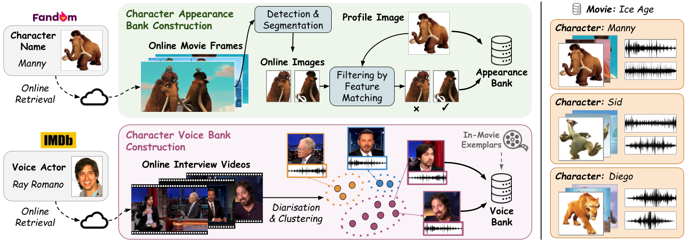

# Audio-Visual Character Bank Construction

## Overview
In the audio-visual character bank, there are image exemplars of characters' appearances and audio exemplar clips of characters' voices. We provide an automatic pipeline for crawling character profile images from [Fandom](https://www.fandom.com/) and additional exemplar images from the web. For audio character bank, we search the actor names on YouTube and crawl the resulted interview videos. We then leverage some postprocessing techniques to extract the voice segments of the queried actors.

<p align="center">
  
</p>


## Visual Character Bank Construction
To build the visual character bank, we provide a CSV file including links to the Fandom pages containing the profile image of each character for all movies in the CMD-AM dataset. To crawl these profile images and save to a local directory, run:

```shell
python build_character_bank/build_appearance_bank/build_csv.py --save_dir {save_dir} --save_file {save_file}
```

Also, this will crawl 25 retrieved character images fron Bing Images and save to the same directory, in order to populate the character image examples. A list of character names for each movie is saved as a JSON file.

Additionally, we provide an automatic pipeline for crawling profile images without Fandom links. However, this sometimes suffer from 404 errors, as the format of the links varies for different movies.

```shell
python build_character_bank/build_appearance_bank/build_online.py --save_dir {save_dir} --save_file {save_file}
```

After crawling the exemplar images, we finetune the DINOv2 contrastively on each movie and extract the visual features from these images for later feature matching.

To finetune DINOv2 at test time for each movie, run:
```shell
python feature_extraction/finetune.py --img_dir {img_dir} --save_folder {save_folder}
```

Then, the visual character bank can be derived using the finetuned DINOv2 features:
```shell
python feature_extraction/feature_extraction.py --img_dir {img_dir} --save_folder {save_folder} --pretrained_weights {pretrained_weights}
```

## Audio Character Bank Construction
Our audio character bank has two sources of audio exemplars, which are actor interviews and in-movie voice exemplars. We start to build it with online crawled actor interviews.

Using the previous JSON file, we load the list of character names for each movie. We then crawl the mapping of character names to cast names on IMDb and get a list of actor names. We then query YouTube and download the most relevant videos. This can be done by:

```shell
python build_voice_bank/interview_crawling.py --save_folder {save_folder} --save_file {save_file}
```

After downloading the interview videos, we adopt a straight-forward clustering algorithm to extract the voice clips of our target actors. We leverage a prior that in the interviews, the largest cluster corresponds to the interviewees.

```shell
python build/voice_bank/clustering.py --src_dir {src_dir} --save_transcription_dir {save_transcription_dir} --cast_information_file {cast_information_file} \
--audio_clip_dir {audio_clip_dir} --audio_feature_dir {audio_feature_dir} --save_file {save_file}
```

This will extract the audio features of the resulted audio clips and save for later audio feature matching.
